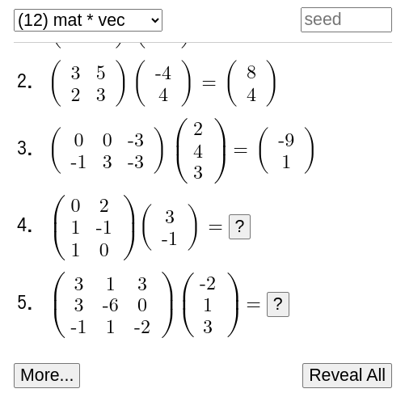

# Matrix Drill

Generate basic exercises for matrix calculation.

* Ensure the exercises produce reasonable answers to avoid overly large numbers.
* Allow any seed text to regenerate the same exercises (except when updates cause incompatibility).

[Demo](https://kaorahi.github.io/matrix_drill/mat.html) / [Project Home](https://github.com/kaorahi/matrix_drill)
